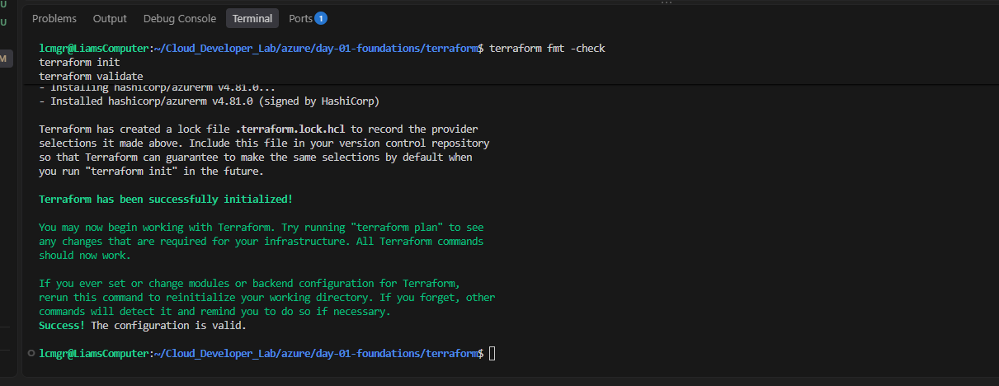

# Cloud Developer Lab

Hands-on cloud development lab focused on building practical skills in Azure, PowerShell, Terraform, Git, GitHub Actions, automation, CI/CD, monitoring, and troubleshooting.

## Purpose

This repository documents my practical cloud learning through small, focused projects.

The goal is to combine structured learning with hands-on implementation rather than relying on theory alone.

Each lab is built, tested, troubleshot, and documented as I progress.

## Technologies

- Microsoft Azure
- PowerShell
- Terraform
- Git and GitHub
- GitHub Actions
- Linux / WSL
- Python
- Infrastructure as Code
- CI/CD
- Azure monitoring and diagnostics

## Learning Approach

Each topic follows a practical workflow:

1. Learn the core concept
2. Build or deploy something
3. Verify the result
4. Troubleshoot failures
5. Document what happened
6. Automate where possible
7. Commit the work to Git

## Repository Structure

```text
Cloud_Developer_Lab/

├── .github/
│   ├── README.md
│   └── workflows/
│       └── terraform.yml
│
├── azure/
│   └── day-01-foundations/
│       ├── images/
│       ├── powershell/
│       │   ├── README.md
│       │   ├── create-resource-group.ps1
│       │   └── deploy-app-service.ps1
│       │
│       ├── terraform/
│       │   ├── README.md
│       │   ├── main.tf
│       │   ├── outputs.tf
│       │   ├── providers.tf
│       │   └── variables.tf
│       │
│       └── README.md
│
├── docs/
│   └── evidence/
│       └── terraform-validation.png
│
├── reference/
│   ├── powershell-syntax.md
│   └── terraform-syntax.md
│
├── .gitignore
└── README.md
```

## Current Progress

### Azure Foundations

Completed practical work includes:

- Azure sandbox access
- Azure Resource Group inspection
- Azure RBAC troubleshooting
- App Service Plan deployment
- Azure Web App deployment
- Web App state verification
- Public hostname retrieval
- PowerShell-based Azure administration

### PowerShell

Used Azure PowerShell to:

- Define reusable variables
- Query Azure resources
- Create an App Service Plan
- Create a Web App
- Retrieve resource properties
- Verify deployment status
- Diagnose permission and parameter errors

### Terraform

Started recreating the Azure deployment using Infrastructure as Code.

Current Terraform configuration includes:

- AzureRM provider configuration
- Reusable input variables
- Existing Resource Group data source
- App Service Plan resource
- Linux Web App resource
- Terraform outputs
- Resource dependencies

### Terraform Validation

Before pushing the Terraform configuration to GitHub, I tested it locally within my WSL Ubuntu environment.

I ran:

```bash
terraform fmt -check
terraform init
terraform validate
```

These checks confirmed:

- `terraform fmt -check` checked that the Terraform configuration followed the expected formatting.
- `terraform init` initialized the working directory and downloaded the required AzureRM provider.
- `terraform validate` checked the HCL configuration for syntax and configuration errors.

The validation completed successfully with:

> Success! The configuration is valid.

This confirmed that the Terraform configuration was structurally valid before being committed and pushed to GitHub.



### GitHub Actions

Started building a generic Terraform CI pipeline.

Current workflow includes:

```text
Git push / Pull Request
        ↓
GitHub Actions
        ↓
Checkout repository
        ↓
Setup Terraform
        ↓
terraform fmt -check
        ↓
terraform init
        ↓
terraform validate
```

Azure deployment authentication is intentionally not configured yet.

The current workflow focuses on validating Infrastructure as Code without requiring persistent cloud credentials.

## Troubleshooting Examples

The labs intentionally document failures as well as successful deployments.

Examples include:

- Azure `403 Forbidden` caused by sandbox RBAC restrictions
- PowerShell parameter-set errors
- Correcting App Service Plan deployment parameters
- Verifying deployed resources after creation
- Terraform planning blocked by intentionally absent Azure authentication

## Reference Documentation

The `reference/` directory contains notes and syntax references created while learning.

Current references include:

- PowerShell syntax
- Terraform / HCL syntax

These are intended to reinforce understanding rather than simply copying commands.

## Next Steps

Planned areas include:

- Complete Terraform CI validation in GitHub Actions
- Capture CI evidence
- Azure Activity Log
- Azure IAM / RBAC
- Azure Metrics
- Resource Health
- Deployment Center
- Python automation
- Azure Storage
- Azure databases
- Monitoring and diagnostics
- Terraform plan in a controlled Azure environment
- CI/CD deployment after authentication and cost controls are configured

## Goal

Build a practical portfolio demonstrating continued development in cloud engineering, automation, Infrastructure as Code, troubleshooting, and DevOps practices.
