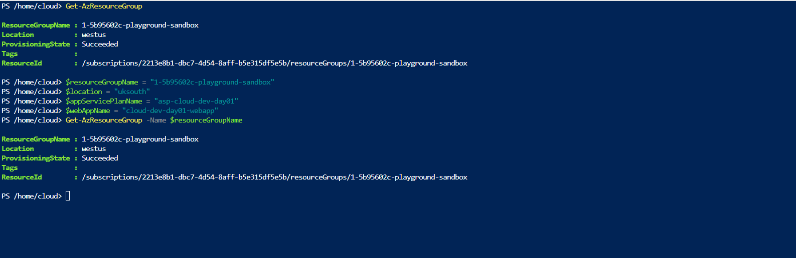
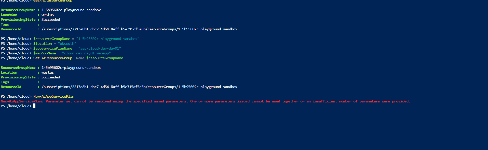
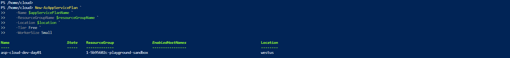
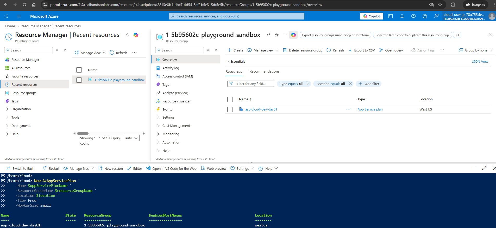
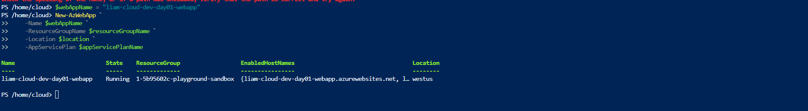
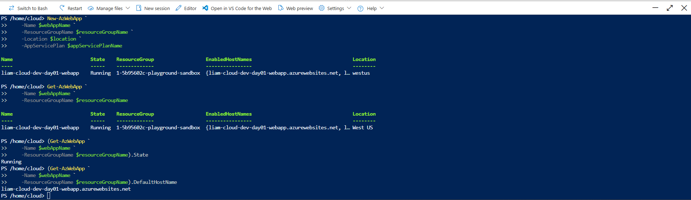

# PowerShell - Day 1

## Goal

Use Azure PowerShell to create, inspect, and verify Azure resources.

## Scripts

### create-resource-group.ps1

Creates an Azure Resource Group.

During testing in the Pluralsight Azure Sandbox, Resource Group creation returned HTTP `403 Forbidden` because the sandbox account did not have permission to create new Resource Groups at subscription scope.

The sandbox-provided Resource Group was therefore used for the remaining exercises.

### deploy-app-service.ps1

Creates an Azure App Service Plan and Web App inside an existing Resource Group, then verifies the Web App state and hostname.

## Concepts Practised

- PowerShell variables
- Azure PowerShell cmdlets
- Cmdlet parameters
- Azure Resource Groups
- Azure RBAC / IAM
- HTTP 403 Forbidden
- App Service
- App Service Plans
- Resource verification
- Troubleshooting PowerShell errors

## Resource Group

The sandbox Resource Group was verified using Azure PowerShell.



## App Service Plan

An Azure App Service Plan was created using PowerShell.

My first attempt returned a parameter-set error:



After correcting the command, I used:

```powershell
New-AzAppServicePlan `
    -Name $appServicePlanName `
    -ResourceGroupName $resourceGroupName `
    -Location $location `
    -Tier Free `
    -WorkerSize Small
```

The App Service Plan was successfully created as:

`asp-cloud-dev-day01`



The plan was also verified in the Azure Portal:



## Web App

A Web App was created using the existing App Service Plan.

```powershell
New-AzWebApp `
    -Name $webAppName `
    -ResourceGroupName $resourceGroupName `
    -Location $location `
    -AppServicePlan $appServicePlanName
```

The Web App was successfully created and entered the `Running` state.



## Verification

After deployment, I verified the Web App using Azure PowerShell.

```powershell
Get-AzWebApp `
    -Name $webAppName `
    -ResourceGroupName $resourceGroupName
```

I then checked the application state:

```powershell
(Get-AzWebApp `
    -Name $webAppName `
    -ResourceGroupName $resourceGroupName).State
```

Result:

`Running`

I also retrieved the default hostname:

```powershell
(Get-AzWebApp `
    -Name $webAppName `
    -ResourceGroupName $resourceGroupName).DefaultHostName
```

Result:

`liam-cloud-dev-day01-webapp.azurewebsites.net`



## What I Learned

Creating a resource is only part of deployment.

After deployment, I should verify that:

- The resource exists
- The expected configuration was applied
- The application is running
- The expected endpoint or hostname was created

I also learned that Azure RBAC can prevent an authenticated user from performing actions they do not have permission to perform, as demonstrated by the HTTP `403 Forbidden` response when attempting to create a Resource Group.

The App Service Plan exercise also demonstrated how PowerShell parameter-set errors can be used to troubleshoot incorrect or incomplete command syntax.